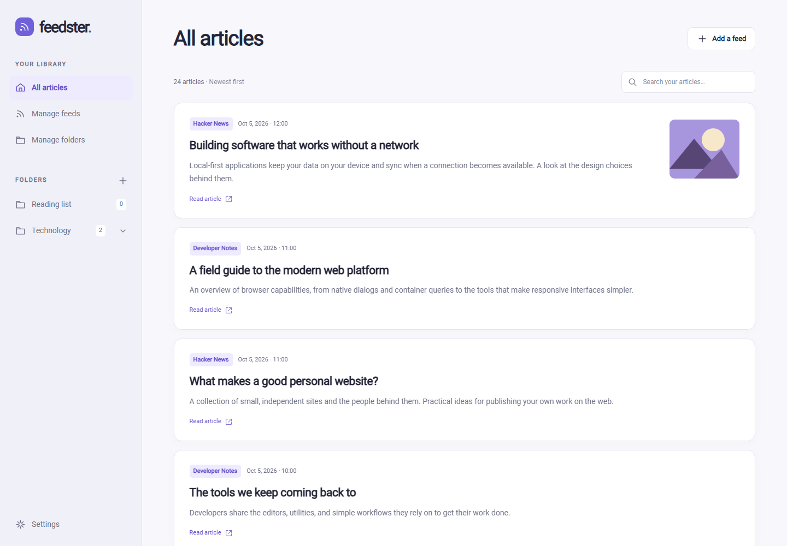
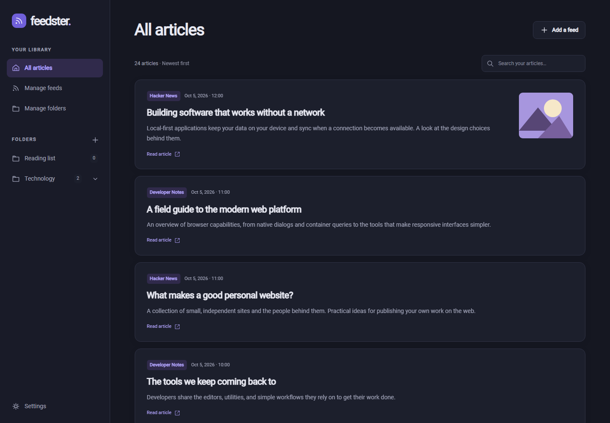
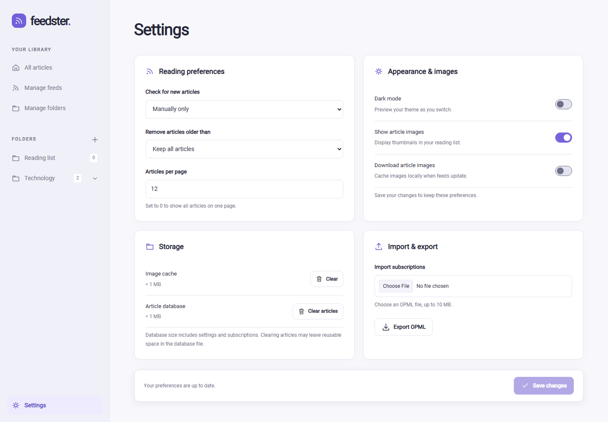
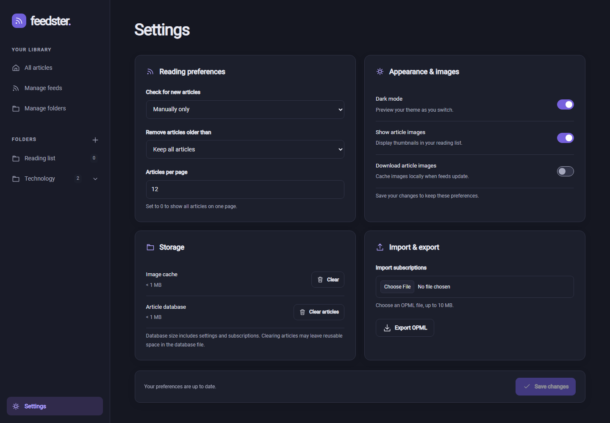
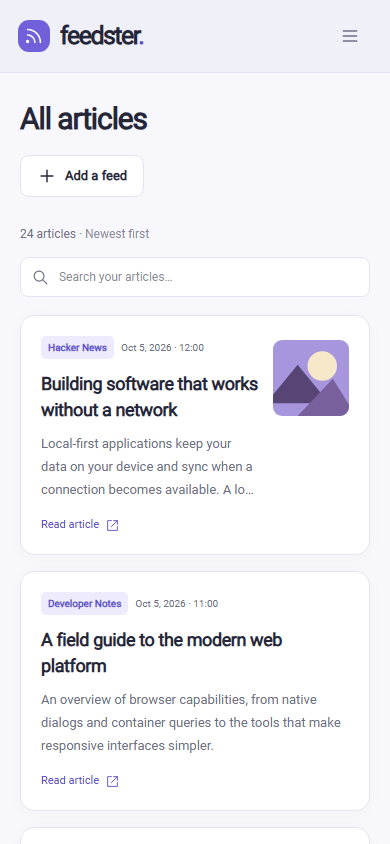
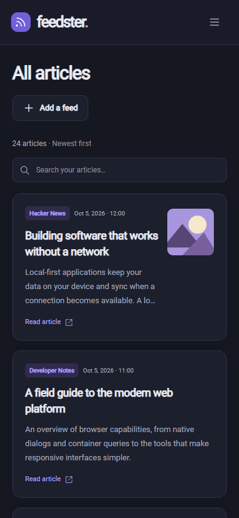

A semi-minimal RSS and Atom reader written in ASP.NET Blazor Server Side.

[](https://github.com/R4cc/feedster/actions/workflows/main.yml)

## Note
**This is more of a personal project that is in very early development than a production ready competitor to TinyRSS or similar projects so you could experience some minor hiccups**

## Features
The following features are built into the application
- Regular auto-fetching of RSS and Atom 1.0 feeds with adjustable timeframe
- Custom feed names
- Dark Mode
- Custom folders for creating custom feeds
- Ready-to-use docker image.
- Responsive desktop, tablet, and mobile layouts.
- Search article titles, descriptions, and source names.
- Keyboard-accessible navigation and dialogs.
- Webp image conversion for optimal performance

Add an Atom 1.0 URL in the same feed manager as RSS feeds; the format is detected automatically.
Atom summaries or inline text/HTML/XHTML content are displayed as plain text. Article links,
categories, and publication dates are imported, with `updated` used when `published` is absent.

## Development checks
Development requires the .NET SDK selected in `global.json` (.NET 10) and Node.js 26.
Run `npm ci --prefix Feedster.Web`, `dotnet build Feedster.sln -c Release`, and
`dotnet test Feedster.sln -c Release --no-build`. Tests use local HTTP fixtures and a temporary
in-memory SQLite database, so they do not require live feeds.

The CSS build uses Tailwind 4. Dialog behavior uses a small local script without Alpine. Release builds minify CSS, and
publish excludes legacy font formats, unused icon assets, source maps, and migration tooling.
For EF migration development, build with `-p:EnableEfTools=true`, then run a matching
`dotnet-ef` 10 tool with `--no-build`. Normal builds and publishes omit those design dependencies.

Docker builds browser assets in a separate Node stage and publishes for the target CPU, so
each image includes only its own image-processing and SQLite native libraries. The runtime
uses the .NET 10 chiseled image with ICU and time-zone data. Existing `/app/data` and
`/app/images` bind mounts remain supported. CI verifies both amd64 and arm64 containers,
including native WebP conversion, SQLite migrations, HTTP pages, compressed assets, and restart.

### Frontend browser checks

After building the solution, publish the app and run the Chromium smoke suite:

```sh
dotnet publish Feedster.Web -c Release --no-build -o artifacts/ui-publish
cd Feedster.Web
npx playwright install chromium
npm run test:ui -- ../artifacts/ui-publish
```

The suite uses a disposable database and a local RSS fixture. It checks article search and
pagination, route changes, feed and folder edits, draft cancellation, settings, OPML,
keyboard focus, and all main screens at 1440, 820, 390, and 320 pixels in both themes.
Set `UI_ARTIFACTS` to retain screenshots outside the temporary workspace.
Set `README_SCREENSHOTS` to an absolute path to `docs/screenshots` to regenerate the README images.
CI also runs these browser checks before publishing the Docker image.

## To-Do
The following features are planned for the future
- Different post layout modes (card, grid, list, compact).
- User authentication and user management system.

## Screenshots

Screenshots show the current interface with sample feeds and articles.

### All articles

| Light | Dark |
| --- | --- |
|  |  |

### Settings

| Light | Dark |
| --- | --- |
|  |  |

### Mobile

<p>
  
  
</p>

## Docker

### For Nginx Reverse Proxy Users
Make sure that "Web Socket support" is enabled for this specific container. This is because Blazor Server communicates with a SignalR connection.

### Docker Run Command Example
In the below command, the application will be accessible at http://localhost:8080 on the host and the files including the database for all the articles would be stored in /your/path/data/ folder.
```
docker run -d \
    --restart unless-stopped \
    -p 8080:8080 \
    -v  /your/path:/app/data \
    -v  /your/path:/app/images \
    index.docker.io/nl2109/feedster:latest
```

### Docker Compose Example
In the below docker-compose.yml example, the application will be accessible at http://localhost:8080 on the host and the files including the database for all the articles would be stored in /your/path/data/ folder.
```
services:
    feedster:
        image: index.docker.io/nl2109/feedster:latest
        container_name: feedster
        restart: unless-stopped
        volumes:
          - /your/path:/app/data
          - /your/path:/app/images
        ports:
          - '8080:8080'
```
